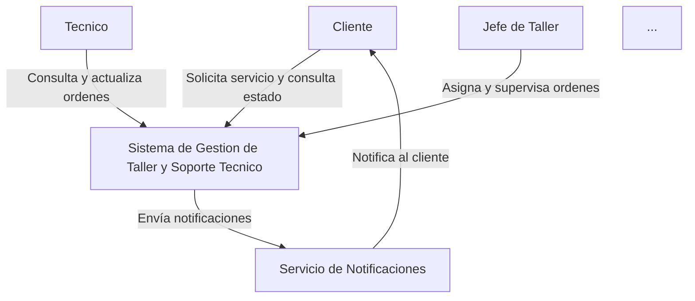

Sistema de Gestión de Taller y Soporte Técnico

El sistema permite gestionar las órdenes de trabajo de un taller técnico, asignar técnicos y realizar el seguimiento de las órdenes.

En esta etapa se integran los patrones Observer y Strategy.

Nivel 1

Descripción

El sistema centraliza la gestión de las órdenes de trabajo del taller.

El Cliente solicita servicios y consulta el estado de sus órdenes. El Técnico consulta las órdenes asignadas y registra sus avances. El Jefe de Taller supervisa las órdenes y asigna técnicos.

El Servicio de Notificaciones permite comunicar al cliente los cambios importantes relacionados con su orden.

Nivel 2
flowchart TB

    cliente["Cliente"]
    tecnico["Tecnico"]
    jefe["Jefe de Taller"]

    subgraph sistema["Sistema de Gestion de Taller y Soporte Tecnico"]

        app["Aplicacion de Gestion"]

        ordenes["Gestion de Ordenes"]

        observer["Observer Notificacion de cambios"]

        asignacion["Asignacion de Tecnicos"]

        strategy["Strategy Reglas de asignacion"]

        datos["Base de Datos"]

    end

    notificaciones["Servicio de Notificaciones"]

    cliente -->|"Consulta orden"| app
    tecnico -->|"Actualiza orden"| app
    jefe -->|"Gestiona asignaciones"| app

    app -->|"Gestiona"| ordenes
    app -->|"Solicita tecnico"| asignacion

    ordenes -->|"Utiliza"| observer
    asignacion -->|"Utiliza"| strategy

    ordenes -->|"Guarda datos"| datos
    asignacion -->|"Consulta tecnicos"| datos

    observer -->|"Envia avisos"| notificaciones
    asignacion -->|"Asigna tecnico"| ordenes
Descripción

La Aplicación de Gestión coordina las operaciones principales del sistema.

Gestión de Órdenes se encarga de registrar las órdenes y controlar sus estados. Dentro de este componente se utiliza Observer, encargado de notificar los cambios de la orden a los interesados.

Asignación de Técnicos se encarga de seleccionar el técnico correspondiente. Dentro de este componente se utiliza Strategy, permitiendo cambiar la regla utilizada para realizar la asignación.

La Base de Datos almacena la información de clientes, técnicos, equipos, órdenes y asignaciones.

El Servicio de Notificaciones representa el servicio utilizado para enviar avisos al cliente.

Integración de Observer y Strategy

Los dos patrones participan en el mismo flujo de una orden:

flowchart TB

    inicio["Orden de Trabajo"]

    estrategia["Strategy"]

    especialidad["Asignar por Especialidad"]
    disponibilidad["Asignar por Disponibilidad"]

    tecnicoAsignado["Tecnico asignado"]

    cambio["Cambio de estado"]

    observer["Observer"]

    cliente["Cliente"]
    tecnico["Tecnico"]

    inicio --> estrategia

    estrategia --> especialidad
    estrategia --> disponibilidad

    especialidad --> tecnicoAsignado
    disponibilidad --> tecnicoAsignado

    tecnicoAsignado --> cambio
    cambio --> observer

    observer --> cliente
    observer --> tecnico

Strategy permite seleccionar la forma de asignar un técnico sin modificar la lógica principal de la orden.

Observer permite notificar automáticamente a los interesados cuando cambia el estado de la orden.

De esta manera, ambos patrones participan en un mismo proceso: Strategy realiza la asignación y Observer comunica el cambio producido en la orden.