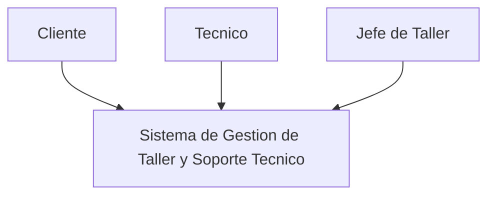

Sistema de Gestion de Taller y Soporte Tecnico

El sistema permite gestionar las ordenes de trabajo de un taller tecnico, realizar la asignacion de tecnicos y mantener informados a los usuarios sobre los cambios de estado de sus ordenes.

En esta etapa se integran los patrones Observer y Strategy.

## Nivel 1

Descripcion

El Sistema de Gestion de Taller y Soporte Tecnico centraliza la gestion de las ordenes de trabajo.

El Cliente solicita servicios y consulta el estado de su orden. El Tecnico consulta las ordenes que tiene asignadas y registra sus avances. El Jefe de Taller supervisa las ordenes y realiza la asignacion de tecnicos.

El sistema tambien se relaciona con un Servicio de Notificaciones, utilizado para informar al cliente cuando ocurre un cambio relevante en su orden.

Nivel 2 — Contenedores principales
flowchart TB

    cliente["Cliente"]
    tecnico["Tecnico"]
    jefe["Jefe de Taller"]

    subgraph sistema["SISTEMA DE GESTION DE TALLER Y SOPORTE TECNICO"]

        aplicacion["Aplicacion de Gestion Coordina las operaciones del sistema"]

        ordenes["Gestion de Órdenes Registra ordenes y controla sus estados  Observer Notifica cambios a los interesados"]

        asignacion["Asignacion de Tecnicos Selecciona la regla para asignar tecnicos  Strategy Por especialidad / disponibilidad"]

        datos["Base de Datos Ordenes, clientes, tecnicos, equipos y asignaciones"]

    end

    notificaciones["Servicio de Notificaciones Email / WhatsApp"]

    cliente -->|"Solicita y consulta"| aplicacion
    tecnico -->|"Consulta y actualiza"| aplicacion
    jefe -->|"Asigna y supervisa"| aplicacion

    aplicacion -->|"Gestiona"| ordenes
    aplicacion -->|"Solicita asignacion"| asignacion

    ordenes -->|"Consulta y guarda informacion"| datos
    asignacion -->|"Obtiene tecnicos disponibles"| datos

    ordenes -->|"Cambio de estado"| notificaciones
    asignacion -->|"Tecnico asignado"| ordenes

Descripcion del Nivel 2

La Aplicacion de Gestion coordina las operaciones principales del sistema.

El modulo Gestion de Órdenes controla las ordenes de trabajo y sus cambios de estado. En este modulo se encuentra el patron Observer, utilizado para notificar al cliente y al tecnico cuando ocurre un cambio en una orden.

El modulo Asignacion de Tecnicos se encarga de seleccionar el tecnico correspondiente. En este modulo se encuentra Strategy, permitiendo cambiar la forma de asignacion, por ejemplo, utilizando una estrategia por especialidad o por disponibilidad.

La Base de Datos almacena la informacion necesaria de clientes, tecnicos, equipos, ordenes y asignaciones.

El Servicio de Notificaciones representa el medio externo utilizado para enviar avisos al cliente.