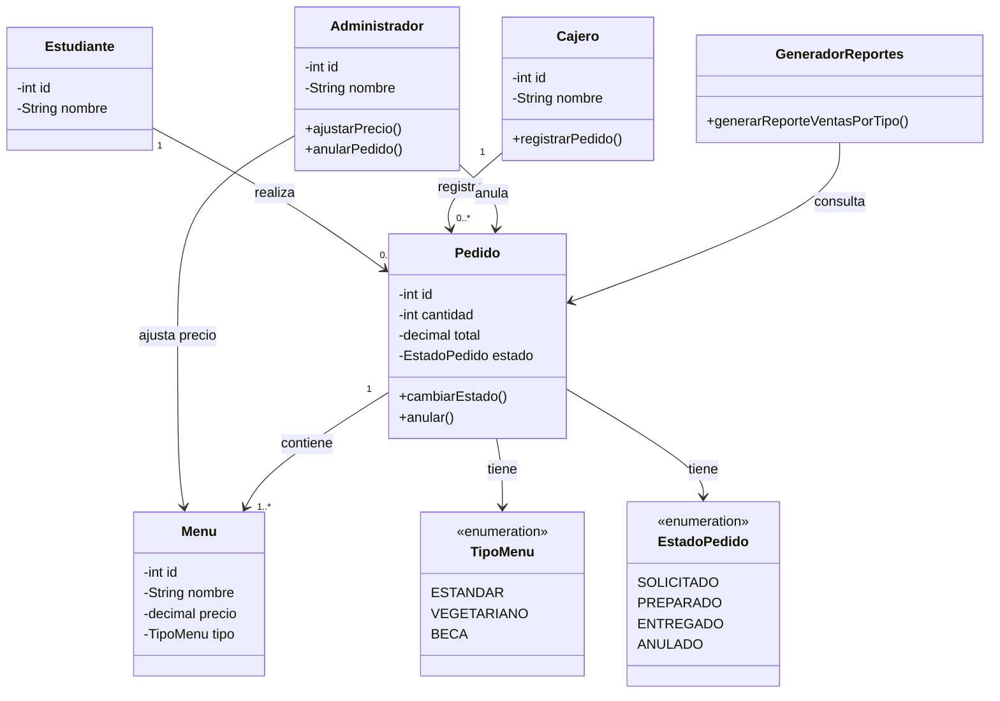

```mermaid
classDiagram
direction TB

%% Nombre completo: Jhair Anderson Choque


class Estudiante {
    -int id
    -String nombre
}

class Pedido {
    -int id
    -int cantidad
    -decimal total
    -EstadoPedido estado
    +cambiarEstado()
    +anular()
}

class Menu {
    -int id
    -String nombre
    -decimal precio
    -TipoMenu tipo
}

class Cajero {
    -int id
    -String nombre
    +registrarPedido()
}

class Administrador {
    -int id
    -String nombre
    +ajustarPrecio()
    +anularPedido()
}

class GeneradorReportes {
    +generarReporteVentasPorTipo()
}

class TipoMenu {
    <<enumeration>>
    ESTANDAR
    VEGETARIANO
    BECA
}

class EstadoPedido {
    <<enumeration>>
    SOLICITADO
    PREPARADO
    ENTREGADO
    ANULADO
}

Estudiante "1" --> "0..*" Pedido : realiza
Cajero "1" --> "0..*" Pedido : registra
Administrador --> Pedido : anula
Administrador --> Menu : ajusta precio
Pedido "1" --> "1..*" Menu : contiene
Pedido --> TipoMenu : tiene
Pedido --> EstadoPedido : tiene
GeneradorReportes --> Pedido : consulta

```